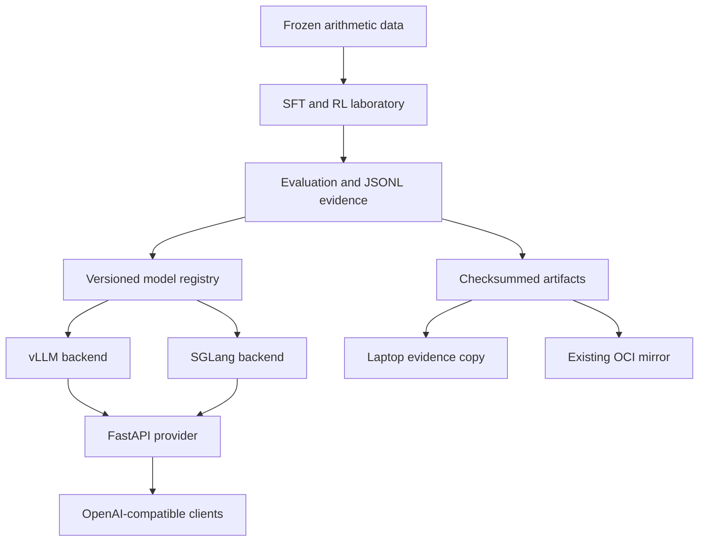

# Mini AI Stack Design Decisions

This document records decisions left open by the specification. It does not replace the specification.

## Decisions

D1. Common model

Use `Qwen/Qwen2.5-0.5B-Instruct` for v1. It fits the educational objective and an L4-backed single-node campaign. Larger models are deferred until this pipeline has complete evidence.

D2. Training approach

Use TRL and PEFT/LoRA for real GPU training, with small framework-independent numerical implementations for educational loss/advantage checks. This separates algorithm understanding from vendor framework behavior.

D3. Deterministic environment

Generate arithmetic examples from frozen template families and split by family. Exact-match reward is normalized conservatively. A template-disjoint test split prevents simple prompt memorization from appearing as learning.

D4. Provider boundary

Implement a FastAPI provider as the only public API surface. vLLM and SGLang are interchangeable private backends behind an async protocol. The provider owns authentication, rate limits, routing, accounting, and telemetry.

D5. Cloud boundary

GCP is the primary GPU environment. Use only one on-demand L4 VM at a time and delete it after two checksum-verified artifact copies exist. OCI is an existing secondary CPU/RAM workspace and artifact mirror, never a new resource created for this project.

D6. Publication boundary

The release is an evidence-backed replication/systems study. Two focused papers are allowed only when their results are independently substantive; otherwise publish one integrated paper. No performance figure is published without a committed result record.

## Architecture

## Minimalism line

v1 does not build an inference engine, GKE deployment, distributed training, a managed database, a managed cache, or long-lived hosting. It implements the smallest reproducible system that can run SFT, policy-gradient comparisons, a KL study, two inference engines, and a routed OpenAI-compatible provider.

## Risks

- L4 capacity or exact pricing may change. Capture a new official quote immediately before any GCP resource creation and require explicit approval.
- The laptop is RAM-constrained. Keep GPU models, large archives, model conversion, and large report aggregation off it when OCI is safer.
- Framework versions may change APIs. Pin direct dependencies and record container/image digests in experiment manifests.
- The $100 cap may prevent all desired repetitions. Preserve partial real evidence and mark incomplete comparisons honestly.
