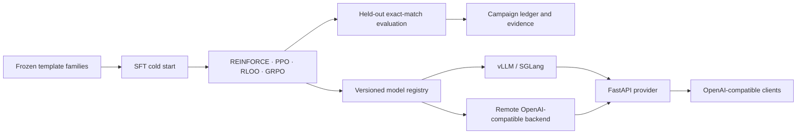

# Mini AI Stack

[](LICENSE)
[](papers/integrated-study/paper.pdf)
[](reports/initial-training-results.md)
[](https://mailtotanvir.github.io/Nano-RL-Inference/blog/blog.html)
[](https://huggingface.co/mailtotanvir/nano-rl-inference-arithmetic-sft-adapter)
[](pyproject.toml)

**A compact post-training laboratory and OpenAI-compatible inference provider for learning where policy optimization, held-out behavior, serving engines, and provider operations agree or diverge.**

Most discussions of modern post-training begin with an optimizer and end with a score. This project begins one layer earlier and ends one layer later. It builds the whole compact chain: frozen task families, SFT, REINFORCE, PPO, RLOO, GRPO, KL measurement, evaluation, model registration, vLLM and SGLang serving, a routed provider API, and two-copy artifact custody.

> The useful artifact is not a tiny model that claims to solve arithmetic. It is a small, inspectable system that refuses to let reward, transfer, serving latency, and operational evidence masquerade as the same thing.

## What this project teaches

A training reward can rise while the behavior that matters remains flat. A serving engine can win one workload cell and lose another. A model endpoint can look compatible while still lacking authentication, routing, usage, and rate boundaries. This repository makes those distinctions concrete with runnable code and an intentionally strict evaluation contract.



## The result that made the system worth building

The final campaign used `Qwen/Qwen2.5-0.5B-Instruct`, 512 addition and subtraction training examples, and a 128-item division-template held-out split. Each configured method ran at seeds 13, 42, and 97. Every saved adapter was evaluated immediately after training.

| Method | Seed 13 | Seed 42 | Seed 97 | Mean held-out accuracy |
|---|---:|---:|---:|---:|
| SFT | 4 / 128 | 4 / 128 | 4 / 128 | 0.03125 |
| REINFORCE | 4 / 128 | 4 / 128 | 4 / 128 | 0.03125 |
| PPO | 4 / 128 | 4 / 128 | 4 / 128 | 0.03125 |
| RLOO | 4 / 128 | 4 / 128 | 4 / 128 | 0.03125 |
| GRPO | 4 / 128 | 4 / 128 | 4 / 128 | 0.03125 |
| GRPO k1 label | 4 / 128 | 4 / 128 | 4 / 128 | 0.03125 |
| GRPO k3 label | 4 / 128 | 4 / 128 | 4 / 128 | 0.03125 |

This is a bounded negative result, not a claim that the methods are equivalent. Under this model, reward, data family, output budget, and strict template-disjoint evaluation, no implemented update path changed the held-out outcome. One GRPO cell reached mean rollout reward `0.79167` and KL `0.37643`, then still scored `4 / 128` on the held-out family.

That gap is the central lesson: an optimization signal can be healthy without establishing transfer.

Read the full three-seed evidence record in [reports/initial-training-results.md](reports/initial-training-results.md) and the claim boundaries in [papers/integrated-study/CLAIM_EVIDENCE_MATRIX.md](papers/integrated-study/CLAIM_EVIDENCE_MATRIX.md).

## Five learning loops, one common contract

Every path starts from the same base model, frozen task family, reward normalization, seed contract, isolated output directory, and held-out evaluator. The point is not to crown an algorithm. It is to understand what each loop asks the system to pay for.

| Method | What it buys | What it costs or risks |
|---|---|---|
| SFT | A reliable answer and format prior from verified demonstrations | Cannot exceed the coverage of those demonstrations |
| REINFORCE | The clearest direct reward-to-policy baseline | Sparse rewards create high-variance updates |
| PPO | A clipped update boundary and KL pressure against destructive movement | Requires old-policy bookkeeping, a reference policy, and advantage design |
| RLOO | Variance reduction through sibling rollout baselines without a learned critic | Requires correctly grouped samples and enough rollouts |
| GRPO | Relative reward inside a response group without a large learned critic | Makes group size, rollout cost, KL, and batch construction first-order settings |

The repository also measures k1 and k3 KL estimates. Their values are close on 32 development prompts, but they are not interchangeable by definition. The current GRPO k1 and k3 labels do not modify the trainer loss, so they are recorded as matched execution labels, not a causal estimator ablation.

## An inference engine is not yet a provider

The merged SFT adapter was exercised through vLLM 0.8.3 and SGLang 0.4.4.post1 on the same NVIDIA L4. Each engine saw short, medium, and long request shapes, with both single-request and concurrency-four cells.

| Workload | vLLM p50 | SGLang p50 | vLLM tok/s | SGLang tok/s | Careful reading |
|---|---:|---:|---:|---:|---|
| Short, single | 136.48 ms | 104.27 ms | 64.90 | 152.04 | SGLang was faster in this cell |
| Short, concurrency 4 | 171.75 ms | 163.92 ms | 53.59 | 37.63 | SGLang had lower p50; vLLM had higher aggregate output rate |
| Medium, single | 941.76 ms | 338.78 ms | 67.70 | 188.16 | SGLang was faster in this cell |
| Medium, concurrency 4 | 1047.66 ms | 405.20 ms | 61.16 | 160.77 | SGLang was faster in this cell |
| Long, single | 430.87 ms | 656.49 ms | 67.26 | 194.84 | Output behavior prevents a universal winner claim |

The result is workload-dependent. Ten measured requests per cell on one L4 and one adapter are enough to expose meaningful tradeoffs, not enough to establish a general engine ranking. Raw measurements and limits are documented in [the paper](papers/integrated-study/paper.pdf) and [engine report](reports/engine-smoke-benchmark.md).

The provider exists to own the product boundary that an engine does not:

| Capability | Implementation | Verified by |
|---|---|---|
| Model identity | Typed registry and deterministic alias routing | unit and contract tests |
| Access control | Hashed bearer-token validation | authentication contract tests |
| Cost and abuse control | Per-identity token bucket and usage ledger | rate-limit and usage tests |
| Compatibility | `/v1/completions`, `/v1/chat/completions`, `/v1/responses`, streaming | provider contract suite |
| Observability | `/health`, `/usage`, `/metrics` | provider acceptance tests |
| Backend portability | vLLM, SGLang, and runtime-only remote OpenAI-compatible backend protocol | local and live acceptance evidence |

## Quick start

The local development path does not require a GPU or remote credentials.

```bash
# Clone after publication
# git clone https://github.com/mailtotanvir/Nano-RL-Inference.git
# cd Nano-RL-Inference

uv sync --extra serve --extra dev
make verify

# Regenerate deterministic train, development, and held-out splits.
uv run python scripts/generate_dataset.py
```

`make verify` runs Ruff, strict mypy on `src`, the test suite, and a secret scan over source, tests, and configuration.

GPU entrypoints live in:

```text
scripts/train_sft.py
scripts/train_reinforce.py
scripts/train_ppo.py
scripts/train_rloo.py
scripts/train_grpo.py
```

They are deliberately excluded from the default local workflow. They require a reviewed GPU campaign, a base-model download, and a configured artifact destination. The project does not ship model weights or credentials.

## Repository map

| Path | Purpose |
|---|---|
| `src/mini_stack/rewards/` | Deterministic exact-match reward and normalization |
| `src/mini_stack/rl/` | Small framework-independent policy, advantage, and KL primitives |
| `src/mini_stack/provider/` | OpenAI-compatible API, routing, auth, rate limits, usage, and metrics |
| `src/mini_stack/backends/` | vLLM, SGLang, and generic remote backend adapters |
| `scripts/` | Dataset generation, training entrypoints, evaluation, campaign orchestration, release verification |
| `configs/` | Typed dataset, experiment, benchmark, and model-registry configuration |
| `tests/` | Unit and provider contract tests |
| `papers/integrated-study/` | Technical report, source, PDF, and claim-to-evidence matrix |
| `reports/` | Result record, engine notes, Definition-of-Done matrix, and publication gate |
| `blog/` | Narrative project article for GitHub Pages |

## Evidence and limits

Every public numeric statement is constrained by an artifact path and a scope boundary. The project does not claim:

- a general ranking of RL methods;
- a general ranking of vLLM and SGLang;
- a production deployment of the provider;
- that a 0.5B model solved arithmetic reasoning;
- that a configuration label is a causal ablation.

See [reports/definition-of-done.md](reports/definition-of-done.md) for complete and partial requirements, and [papers/integrated-study/CLAIM_EVIDENCE_MATRIX.md](papers/integrated-study/CLAIM_EVIDENCE_MATRIX.md) for the release claim boundary.

## Read and cite

- Technical report: [Building a Miniature AI Factory](https://mailtotanvir.github.io/Nano-RL-Inference/papers/integrated-study/paper.pdf)
- Project article: [The miniature AI factory](https://mailtotanvir.github.io/Nano-RL-Inference/blog/blog.html)
- Hugging Face adapter: [nano-rl-inference-arithmetic-sft-adapter](https://huggingface.co/mailtotanvir/nano-rl-inference-arithmetic-sft-adapter)
- Citation metadata: [CITATION.cff](CITATION.cff)
- Zenodo DOI: minted from the first public GitHub release and added here after verification

## License

Apache-2.0. See [LICENSE](LICENSE).
